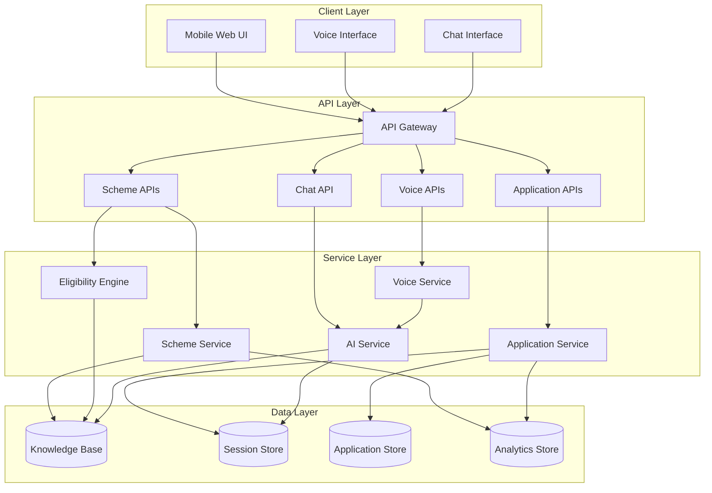

# Design Document: AI Civic Information & Service Assistant

## Overview

The AI Civic Information & Service Assistant is a mobile-first web application that provides citizens with conversational access to government schemes through a chatbot interface. The system combines AI-powered natural language understanding with structured scheme data to deliver personalized guidance, eligibility assessment, and step-by-step application assistance.

The architecture follows a client-server model with a React-based frontend, Node.js/Express backend, and integration with AI services for natural language processing and voice capabilities. The system prioritizes simplicity, accessibility, and fast deployment using mock data for demonstration purposes.

## Architecture

### High-Level Architecture



### Technology Stack

**Frontend:**
- React with TypeScript for component-based UI
- Tailwind CSS for mobile-first responsive design
- Web Speech API for voice input/output
- Axios for API communication
- React Context for state management

**Backend:**
- Node.js with Express for REST API
- In-memory data structures for mock data storage
- OpenAI API or similar for AI-powered responses
- Web Speech API or cloud TTS/STT services for voice processing

**Deployment:**
- Static hosting for frontend (Vercel, Netlify)
- Serverless functions or lightweight Node.js server for backend
- Environment variables for API keys and configuration

## Components and Interfaces

### 1. Frontend Components

#### ChatInterface Component
Manages the conversational UI with message history, input field, and voice controls.

```typescript
interface Message {
  id: string;
  role: 'user' | 'assistant';
  content: string;
  timestamp: Date;
  language: string;
}

interface ChatInterfaceProps {
  sessionId: string;
  language: string;
  onLanguageChange: (lang: string) => void;
}

class ChatInterface {
  sendMessage(content: string): Promise<Message>
  sendVoiceMessage(audioBlob: Blob): Promise<Message>
  loadHistory(): Promise<Message[]>
  clearHistory(): void
}
```

#### SchemeCard Component
Displays scheme information in a scannable card format with icons.

```typescript
interface Scheme {
  id: string;
  name: string;
  category: string;
  description: string;
  benefits: string[];
  icon: string;
}

interface SchemeCardProps {
  scheme: Scheme;
  onSelect: (schemeId: string) => void;
}
```

#### ApplicationWizard Component
Guides users through multi-step application forms.

```typescript
interface ApplicationStep {
  stepNumber: number;
  question: string;
  fieldType: 'text' | 'number' | 'select' | 'date';
  options?: string[];
  validation?: ValidationRule;
}

interface ApplicationWizardProps {
  schemeId: string;
  sessionId: string;
  onComplete: (applicationId: string) => void;
}

class ApplicationWizard {
  loadProgress(): Promise<ApplicationStep>
  saveStep(stepNumber: number, value: any): Promise<void>
  submitApplication(): Promise<string>
}
```

#### VoiceControl Component
Handles voice input and output with visual feedback.

```typescript
interface VoiceControlProps {
  language: string;
  onTranscript: (text: string) => void;
  onError: (error: Error) => void;
}

class VoiceControl {
  startListening(): void
  stopListening(): void
  speak(text: string): void
  stopSpeaking(): void
}
```

### 2. Backend API Endpoints

#### Scheme APIs

```typescript
// GET /api/schemes/search?query=education&category=student
interface SchemeSearchRequest {
  query?: string;
  category?: string;
  language: string;
}

interface SchemeSearchResponse {
  schemes: Scheme[];
  suggestions?: string[];
}

// GET /api/schemes/details/:schemeId?language=en
interface SchemeDetailsResponse {
  scheme: SchemeDetails;
}

interface SchemeDetails extends Scheme {
  eligibilityCriteria: EligibilityCriterion[];
  requiredDocuments: Document[];
  applicationProcess: string[];
  benefits: string[];
}

// POST /api/schemes/eligibility-check
interface EligibilityCheckRequest {
  schemeId: string;
  userInputs: Record<string, any>;
  language: string;
}

interface EligibilityCheckResponse {
  eligible: boolean;
  explanation: string;
  unmetCriteria?: string[];
  nextSteps?: string[];
}

// GET /api/schemes/documents/:schemeId?language=en
interface DocumentsResponse {
  documents: Document[];
}

interface Document {
  id: string;
  name: string;
  description: string;
  category: string;
  icon: string;
  required: boolean;
}
```

#### Application APIs

```typescript
// POST /api/application/start
interface ApplicationStartRequest {
  schemeId: string;
  sessionId: string;
  language: string;
}

interface ApplicationStartResponse {
  applicationId: string;
  currentStep: ApplicationStep;
}

// POST /api/application/progress
interface ApplicationProgressRequest {
  applicationId: string;
  stepNumber: number;
  value: any;
}

interface ApplicationProgressResponse {
  nextStep?: ApplicationStep;
  completed: boolean;
}

// POST /api/application/submit
interface ApplicationSubmitRequest {
  applicationId: string;
}

interface ApplicationSubmitResponse {
  trackingReference: string;
  status: string;
  message: string;
}

// GET /api/application/status/:trackingReference
interface ApplicationStatusResponse {
  trackingReference: string;
  status: 'Submitted' | 'Under Review' | 'Approved' | 'Rejected';
  statusMessage: string;
  nextSteps: string[];
  submittedAt: Date;
  updatedAt: Date;
}
```

#### Chat API

```typescript
// POST /api/chat/query
interface ChatQueryRequest {
  sessionId: string;
  message: string;
  language: string;
  context?: ConversationContext;
}

interface ChatQueryResponse {
  response: string;
  suggestions?: string[];
  relatedSchemes?: Scheme[];
}

interface ConversationContext {
  currentScheme?: string;
  currentApplication?: string;
  recentTopics: string[];
}
```

#### Voice APIs

```typescript
// POST /api/voice/input
interface VoiceInputRequest {
  audioData: string; // base64 encoded audio
  language: string;
  sessionId: string;
}

interface VoiceInputResponse {
  transcript: string;
  chatResponse: ChatQueryResponse;
}

// POST /api/voice/output
interface VoiceOutputRequest {
  text: string;
  language: string;
}

interface VoiceOutputResponse {
  audioUrl: string; // URL to generated audio file
  duration: number;
}
```

### 3. Service Layer Components

#### SchemeService
Manages scheme data retrieval and search functionality.

```typescript
class SchemeService {
  searchSchemes(query: string, category: string, language: string): Scheme[]
  getSchemeDetails(schemeId: string, language: string): SchemeDetails
  getDocuments(schemeId: string, language: string): Document[]
  recordSchemeView(schemeId: string): void
}
```

#### EligibilityEngine
Evaluates user inputs against scheme eligibility criteria.

```typescript
interface EligibilityCriterion {
  field: string;
  operator: 'equals' | 'greaterThan' | 'lessThan' | 'between' | 'in';
  value: any;
  description: string;
}

class EligibilityEngine {
  checkEligibility(
    schemeId: string,
    userInputs: Record<string, any>
  ): EligibilityResult
  
  generateExplanation(
    result: EligibilityResult,
    language: string
  ): string
}

interface EligibilityResult {
  eligible: boolean;
  metCriteria: EligibilityCriterion[];
  unmetCriteria: EligibilityCriterion[];
}
```

#### ApplicationService
Manages application lifecycle and progress tracking.

```typescript
interface Application {
  id: string;
  schemeId: string;
  sessionId: string;
  steps: ApplicationStep[];
  currentStepNumber: number;
  responses: Record<number, any>;
  status: 'in_progress' | 'submitted';
  trackingReference?: string;
  createdAt: Date;
  updatedAt: Date;
}

class ApplicationService {
  startApplication(schemeId: string, sessionId: string): Application
  saveProgress(applicationId: string, stepNumber: number, value: any): void
  getNextStep(applicationId: string): ApplicationStep | null
  submitApplication(applicationId: string): string
  getApplicationStatus(trackingReference: string): ApplicationStatus
}
```

#### AIService
Handles natural language understanding and response generation.

```typescript
interface AIPrompt {
  systemContext: string;
  conversationHistory: Message[];
  knowledgeBase: string;
  userQuery: string;
}

class AIService {
  generateResponse(prompt: AIPrompt, language: string): Promise<string>
  extractIntent(message: string): Intent
  generateEligibilityExplanation(
    result: EligibilityResult,
    language: string
  ): string
}

interface Intent {
  type: 'search' | 'eligibility' | 'application' | 'status' | 'general';
  entities: Record<string, any>;
}
```

#### VoiceService
Manages speech-to-text and text-to-speech conversion.

```typescript
class VoiceService {
  transcribeAudio(audioData: Buffer, language: string): Promise<string>
  synthesizeSpeech(text: string, language: string): Promise<Buffer>
  detectLanguage(audioData: Buffer): Promise<string>
}
```

### 4. Data Layer

#### Knowledge Base Structure

```typescript
interface KnowledgeBase {
  schemes: Map<string, SchemeDetails>;
  categories: Category[];
  translations: Map<string, Translation>;
}

interface Category {
  id: string;
  name: string;
  icon: string;
  translations: Record<string, string>;
}

interface Translation {
  language: string;
  key: string;
  value: string;
}
```

#### Session Store

```typescript
interface Session {
  id: string;
  language: string;
  conversationHistory: Message[];
  currentContext: ConversationContext;
  createdAt: Date;
  expiresAt: Date;
}

class SessionStore {
  createSession(): Session
  getSession(sessionId: string): Session | null
  updateSession(sessionId: string, updates: Partial<Session>): void
  expireSessions(): void
}
```

#### Application Store

```typescript
class ApplicationStore {
  saveApplication(application: Application): void
  getApplication(applicationId: string): Application | null
  getApplicationByTracking(trackingReference: string): Application | null
  updateApplicationStatus(
    trackingReference: string,
    status: string
  ): void
}
```

#### Analytics Store

```typescript
interface SchemeAnalytics {
  schemeId: string;
  viewCount: number;
  eligibilityCheckCount: number;
  applicationCount: number;
}

interface DailyMetrics {
  date: Date;
  totalInteractions: number;
  uniqueSessions: number;
  topSchemes: string[];
}

class AnalyticsStore {
  recordSchemeView(schemeId: string): void
  recordEligibilityCheck(schemeId: string): void
  recordApplication(schemeId: string): void
  recordInteraction(sessionId: string): void
  getSchemeAnalytics(): SchemeAnalytics[]
  getDailyMetrics(startDate: Date, endDate: Date): DailyMetrics[]
}
```

## Data Models

### Scheme Data Model

```typescript
interface Scheme {
  id: string;
  name: Record<string, string>; // language -> name
  category: string;
  description: Record<string, string>; // language -> description
  icon: string;
  eligibilityCriteria: EligibilityCriterion[];
  benefits: Record<string, string[]>; // language -> benefits
  requiredDocuments: Document[];
  applicationSteps: ApplicationStep[];
  active: boolean;
}
```

### Mock Data Structure

For fast-track demonstration, the system will include 5-10 hardcoded schemes:

1. **Student Education Grant** - Financial assistance for students
2. **Senior Citizen Pension** - Monthly pension for elderly citizens
3. **Small Business Loan** - Low-interest loans for entrepreneurs
4. **Healthcare Subsidy** - Medical expense reimbursement
5. **Housing Assistance** - Support for affordable housing
6. **Agricultural Support** - Subsidies for farmers
7. **Women Empowerment Program** - Skills training and financial aid
8. **Disability Benefits** - Support for persons with disabilities

Each scheme will have:
- Eligibility criteria (age, income, occupation, etc.)
- Required documents (ID proof, income certificate, etc.)
- 3-5 application steps
- Translations in 3 languages


## Correctness Properties

A property is a characteristic or behavior that should hold true across all valid executions of a system—essentially, a formal statement about what the system should do. Properties serve as the bridge between human-readable specifications and machine-verifiable correctness guarantees.

### Property 1: Complete Scheme Details
*For any* valid scheme ID, the scheme details API response should contain all mandatory fields including benefits, eligibility criteria, and application process.
**Validates: Requirements 1.2**

### Property 2: Search Filter Accuracy
*For any* valid filter combination (category, keyword, benefit type), all returned schemes should match the specified filters.
**Validates: Requirements 1.3**

### Property 3: Eligibility Determinism
*For any* scheme and any set of user inputs, the eligibility engine should return a deterministic result (same inputs always produce same output).
**Validates: Requirements 2.1**

### Property 4: Ineligibility Explanation Completeness
*For any* eligibility check that returns ineligible, the response should include all unmet criteria.
**Validates: Requirements 2.4**

### Property 5: Eligible Response Includes Documents
*For any* eligibility check that returns eligible, the response should include the required document checklist.
**Validates: Requirements 2.5**

### Property 6: Complete Document Checklist
*For any* valid scheme ID, the documents API should return all required documents for that scheme.
**Validates: Requirements 3.1**

### Property 7: Document Structure Completeness
*For any* document in a document list, it should have category and icon fields populated.
**Validates: Requirements 3.3**

### Property 8: Contextual Document Filtering
*For any* set of user eligibility inputs, the returned document checklist should only include documents relevant to the user's situation.
**Validates: Requirements 3.4**

### Property 9: Application Initialization
*For any* valid scheme ID, starting an application should create a unique application ID and return the first step.
**Validates: Requirements 4.1**

### Property 10: Application Step Progression
*For any* application in progress, saving a step with valid data should either return the next step or mark the application as complete.
**Validates: Requirements 4.2**

### Property 11: Application Progress Persistence (Round Trip)
*For any* application, if progress is saved at step N and then retrieved, the system should resume at step N with the saved data intact.
**Validates: Requirements 4.4**

### Property 12: Application Submission Completeness
*For any* complete application (all required fields filled), submission should succeed and return a unique tracking reference.
**Validates: Requirements 4.5**

### Property 13: Session Context Accumulation
*For any* session, if multiple messages are sent, the conversation history should accumulate and be retrievable.
**Validates: Requirements 5.5**

### Property 14: Voice Input Transcription
*For any* valid audio input in a supported language, the voice input API should return a text transcript.
**Validates: Requirements 6.1**

### Property 15: Voice Output Generation
*For any* text input in a supported language, the voice output API should return audio data.
**Validates: Requirements 6.2**

### Property 16: Language-Specific Responses
*For any* supported language, when a user selects that language, all API responses should be in that language.
**Validates: Requirements 7.2**

### Property 17: Multilingual Knowledge Base
*For any* scheme and any supported language, the scheme data should exist in that language.
**Validates: Requirements 7.3**

### Property 18: Language Switch Preserves State
*For any* session, changing the language should preserve conversation history and application progress.
**Validates: Requirements 7.4**

### Property 19: Session Creation
*For any* user interaction, a session ID should be generated and returned if one doesn't exist.
**Validates: Requirements 8.1**

### Property 20: Session Data Persistence
*For any* session with stored interactions, retrieving the session should return all stored conversation history and application progress.
**Validates: Requirements 8.2**

### Property 21: Session Restoration (Round Trip)
*For any* session, if data is stored and retrieved within 24 hours, the retrieved data should match the stored data.
**Validates: Requirements 8.3**

### Property 22: Session Expiration
*For any* session older than 24 hours, it should be marked as expired and not retrievable.
**Validates: Requirements 8.4**

### Property 23: Tracking Reference Uniqueness
*For any* two different applications, their tracking references should be unique.
**Validates: Requirements 9.1**

### Property 24: Status Lookup Completeness
*For any* valid tracking reference, the status API should return current status and next steps.
**Validates: Requirements 9.2**

### Property 25: Knowledge Base Schema Completeness
*For any* scheme in the knowledge base, it should have all required fields: name, description, eligibility criteria, benefits, required documents, and application process.
**Validates: Requirements 11.1**

### Property 26: Scheme CRUD Operations
*For any* scheme, the system should support adding it, updating it, retrieving it, and removing it successfully.
**Validates: Requirements 11.2**

### Property 27: Scheme Update Immediacy
*For any* scheme, if it is updated and then immediately queried, the query should return the updated version.
**Validates: Requirements 11.3**

### Property 28: Analytics Counter Increment
*For any* scheme interaction (search, eligibility check, or application), the corresponding analytics counter for that scheme should increment.
**Validates: Requirements 12.1**

### Property 29: Daily Metrics Aggregation
*For any* day with user interactions, the daily metrics should record the total interaction count.
**Validates: Requirements 12.2**

### Property 30: Analytics Data Retrieval
*For any* recorded analytics data, querying the analytics API should return the aggregated metrics.
**Validates: Requirements 12.3**

### Property 31: Analytics Privacy Compliance
*For any* analytics record, it should not contain personally identifiable information fields (name, email, phone, address).
**Validates: Requirements 12.4**

## Error Handling

### API Error Responses

All API endpoints will follow a consistent error response format:

```typescript
interface ErrorResponse {
  error: {
    code: string;
    message: string;
    details?: any;
  };
  timestamp: Date;
  path: string;
}
```

### Error Categories

**Client Errors (4xx):**
- `400 Bad Request`: Invalid input parameters or malformed request body
- `404 Not Found`: Requested resource (scheme, application, session) doesn't exist
- `422 Unprocessable Entity`: Valid request format but business logic validation failed

**Server Errors (5xx):**
- `500 Internal Server Error`: Unexpected server-side error
- `503 Service Unavailable`: External service (AI, voice) temporarily unavailable

### Specific Error Scenarios

**Scheme Not Found:**
```typescript
{
  error: {
    code: "SCHEME_NOT_FOUND",
    message: "The requested scheme does not exist",
    details: { schemeId: "invalid-id" }
  }
}
```

**Invalid Eligibility Inputs:**
```typescript
{
  error: {
    code: "INVALID_ELIGIBILITY_INPUTS",
    message: "Required eligibility fields are missing",
    details: { missingFields: ["age", "income"] }
  }
}
```

**Session Expired:**
```typescript
{
  error: {
    code: "SESSION_EXPIRED",
    message: "Your session has expired. Please start a new session.",
    details: { sessionId: "expired-session-id" }
  }
}
```

**Application Not Complete:**
```typescript
{
  error: {
    code: "APPLICATION_INCOMPLETE",
    message: "Cannot submit application with incomplete steps",
    details: { 
      completedSteps: 3,
      totalSteps: 5,
      missingSteps: [4, 5]
    }
  }
}
```

**Voice Processing Error:**
```typescript
{
  error: {
    code: "VOICE_PROCESSING_FAILED",
    message: "Unable to process audio input",
    details: { reason: "Unsupported audio format" }
  }
}
```

**AI Service Unavailable:**
```typescript
{
  error: {
    code: "AI_SERVICE_UNAVAILABLE",
    message: "AI service is temporarily unavailable. Please try again.",
    details: { retryAfter: 30 }
  }
}
```

### Frontend Error Handling

The frontend will implement graceful degradation:

1. **Network Errors**: Display retry button with offline indicator
2. **Validation Errors**: Show inline field-level error messages
3. **Session Expiration**: Automatically create new session and inform user
4. **Voice Errors**: Fall back to text input with helpful message
5. **AI Unavailable**: Show cached responses or fallback to rule-based responses

### Error Recovery Strategies

**Session Recovery:**
- Automatically create new session if expired
- Preserve last known language preference in localStorage
- Offer to restore application progress if available

**Application Progress Recovery:**
- Auto-save every step completion
- Provide "Resume Application" option on return
- Allow manual save with "Save for Later" button

**Voice Fallback:**
- If voice input fails, show text input field
- If voice output fails, display text response
- Provide manual language selection if auto-detection fails

## Testing Strategy

The testing strategy employs a dual approach combining unit tests for specific scenarios and property-based tests for universal correctness guarantees.

### Property-Based Testing

Property-based testing will validate the correctness properties defined above using **fast-check** (for TypeScript/JavaScript). Each property test will:

- Run a minimum of 100 iterations with randomly generated inputs
- Be tagged with a comment referencing the design property
- Tag format: `// Feature: civic-assistant, Property N: [property description]`

**Example Property Test:**

```typescript
import fc from 'fast-check';

// Feature: civic-assistant, Property 1: Complete Scheme Details
test('scheme details contain all mandatory fields', () => {
  fc.assert(
    fc.property(
      fc.constantFrom(...validSchemeIds),
      async (schemeId) => {
        const response = await getSchemeDetails(schemeId);
        expect(response).toHaveProperty('benefits');
        expect(response).toHaveProperty('eligibilityCriteria');
        expect(response).toHaveProperty('applicationProcess');
        expect(response.benefits).toBeInstanceOf(Array);
        expect(response.eligibilityCriteria).toBeInstanceOf(Array);
        expect(response.applicationProcess).toBeInstanceOf(Array);
      }
    ),
    { numRuns: 100 }
  );
});
```

### Unit Testing

Unit tests will focus on:

**Specific Examples:**
- Test each mock scheme with known inputs and expected outputs
- Verify specific eligibility scenarios (e.g., age 65+ qualifies for senior pension)
- Test specific error conditions (e.g., empty search query)

**Edge Cases:**
- Empty or null inputs
- Boundary values (e.g., age exactly at threshold)
- Maximum length inputs
- Special characters in text inputs
- Unsupported language codes

**Integration Points:**
- API endpoint request/response formats
- Session creation and retrieval
- Application state transitions
- Analytics recording

**Example Unit Tests:**

```typescript
describe('EligibilityEngine', () => {
  test('senior citizen pension requires age >= 65', () => {
    const result = checkEligibility('senior-pension', { age: 65 });
    expect(result.eligible).toBe(true);
  });

  test('senior citizen pension rejects age < 65', () => {
    const result = checkEligibility('senior-pension', { age: 64 });
    expect(result.eligible).toBe(false);
    expect(result.unmetCriteria).toContain('age');
  });

  test('empty search query returns error', () => {
    expect(() => searchSchemes('')).toThrow('INVALID_SEARCH_QUERY');
  });
});
```

### Test Coverage Goals

- **Unit Test Coverage**: Minimum 80% code coverage
- **Property Test Coverage**: All 31 correctness properties implemented
- **Integration Test Coverage**: All API endpoints tested
- **E2E Test Coverage**: Critical user flows (search → eligibility → application)

### Testing Tools

- **Unit Testing**: Jest or Vitest
- **Property-Based Testing**: fast-check
- **API Testing**: Supertest
- **E2E Testing**: Playwright or Cypress (optional for MVP)
- **Coverage**: Istanbul/nyc

### Continuous Testing

- Run unit tests on every commit
- Run property tests on pull requests
- Run integration tests before deployment
- Monitor test execution time (target: < 30 seconds for unit + property tests)

### Mock Data Testing

Since the system uses hardcoded mock data:
- Create test fixtures for all 5-10 schemes
- Test with all supported languages
- Verify data consistency across translations
- Test edge cases specific to each scheme's eligibility rules

The dual testing approach ensures both concrete correctness (unit tests) and universal correctness (property tests), providing comprehensive validation while maintaining fast test execution for rapid iteration.
